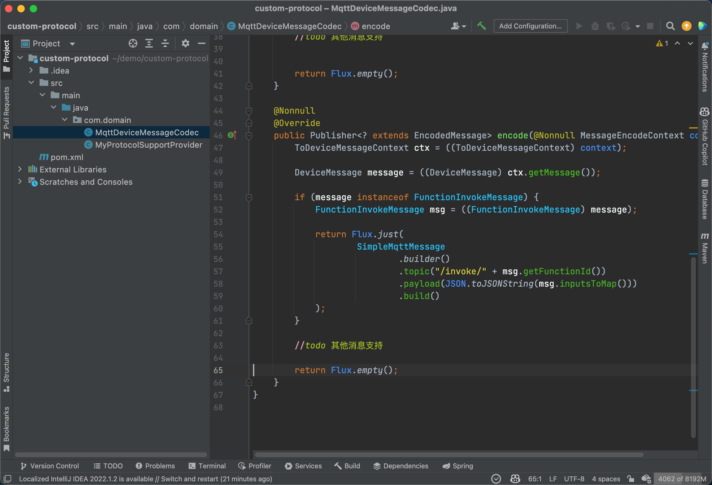
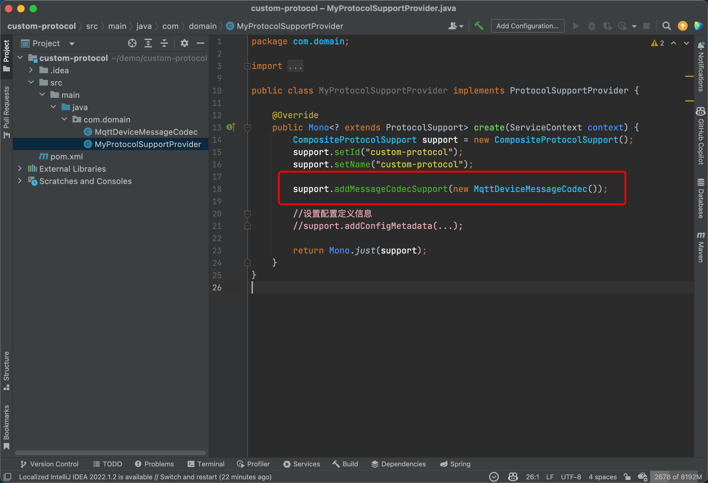
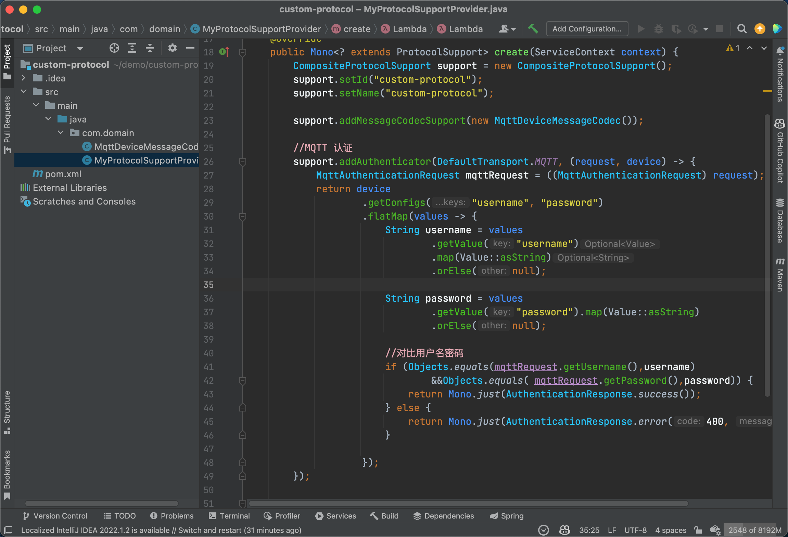
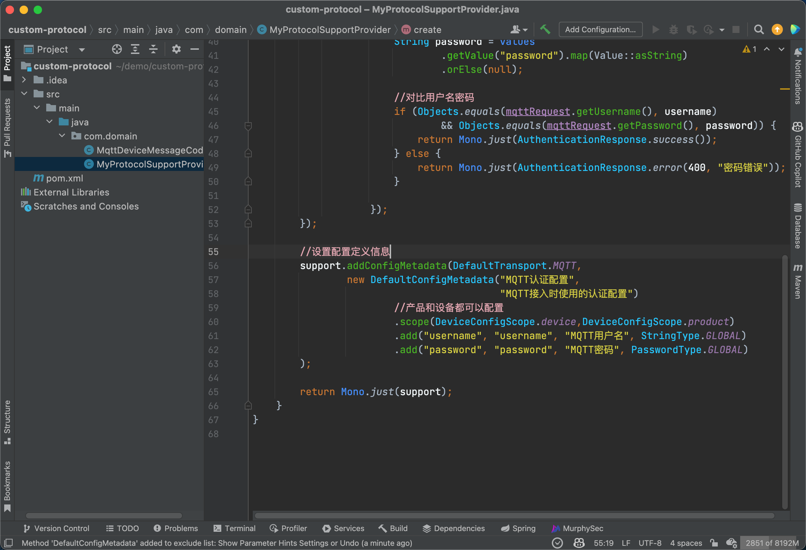
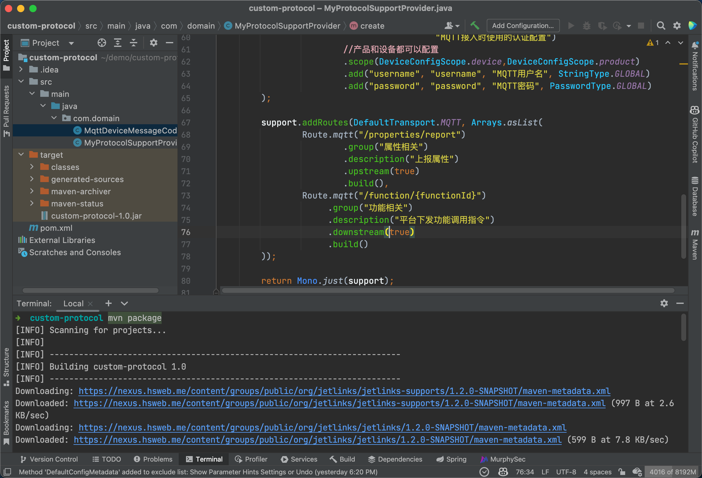
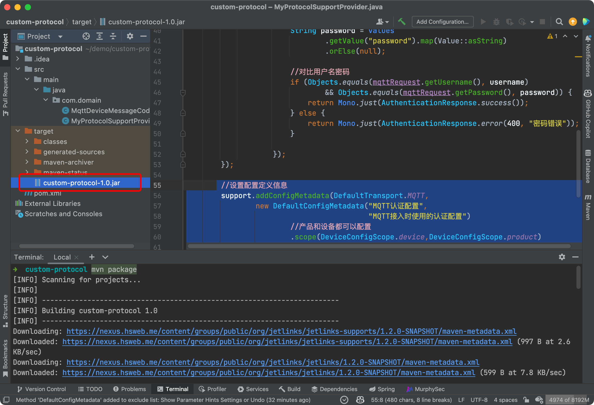

# MQTT协议解析

本文基于[快速开始](first.md)进行MQTT协议解析开发说明,在开发之前请先阅读之.


## 创建mqtt编解码类
   
创建`MqttDeviceMessageCodec`并实现`DeviceMessageCodec`接口


## 编写解码逻辑

编辑`decode方法`


## 编写编码逻辑

编辑`encode方法`



## 将编解码器注册到协议中

编辑类`MyProtocolSupportProvider`



## 编写MQTT认证规则
   
通过mqtt直连接入时,需要先对`mqtt`请求进行认证.
在mqtt客户端发送`CONNECT`报文时,平台会根据`clientId`获取对应的设备实例,
然后调用此设备的协议包进行认证.认证通过后建立连接.



```java
//MQTT 认证
support.addAuthenticator(DefaultTransport.MQTT, (request, device) -> {
MqttAuthenticationRequest mqttRequest = ((MqttAuthenticationRequest) request);
return device
        .getConfigs("username", "password")
        .flatMap(values -> {
            String username = values.getValue("username").map(Value::asString).orElse(null);
            String password = values.getValue("password").map(Value::asString).orElse(null);
            if (mqttRequest.getUsername().equals(username) && mqttRequest
                    .getPassword()
                    .equals(password)) {
                return Mono.just(AuthenticationResponse.success());
            } else {
                return Mono.just(AuthenticationResponse.error(400, "密码错误"));
            }
        });
});
```

::: tip 温馨提示

图中的`device.getConfigs`表示: 先从设备中获取配置,如果不存在则从产品中获取.
如果只从设备中获取可以使用`device.getSelfConfigs`

:::

## 定义MQTT配置描述
   
在第5步中需要获取设备的配置信息`username`,`password`.
通过定义mqtt配置描述来告诉平台,使用该协议的产品或者设备需要进行相应的配置.
在对应的产品或者设备界面才会出现配置项目输入.



```java
 //设置配置定义信息
support.addConfigMetadata(DefaultTransport.MQTT,
    new DefaultConfigMetadata("MQTT认证配置", "MQTT接入时使用的认证配置")
            //产品和设备都可以配置
            .scope(DeviceConfigScope.device,DeviceConfigScope.product)
            .add("username", "username", "MQTT用户名", StringType.GLOBAL)
            .add("password", "password", "MQTT密码", PasswordType.GLOBAL)
);
```

## 定义topic

::: tip 注意
在`2.0`版本后,如果是通过`mqtt broker`接入的设备,必须进行此步骤. 
因为在启动设备接入网关时,会获取协议包定义的topic去从`mqtt broker`订阅数据.

可以通过`{}`来指定`动态topic`,
如 `/function/{functionId}`,订阅时会自动转换为mqtt的topic`/functoin/+`,
如果要使用`#`则可以这样定义: `/function/{#functionId}`,订阅时会自动转换为mqtt的topic`/functoin/#`

:::



```java
support.addRoutes(DefaultTransport.MQTT, Arrays.asList(
        Route.mqtt("/properties/report")
                .group("属性相关")
                .description("上报属性")
                .upstream(true)
                .build(),
        Route.mqtt("/function/{functionId}")
                .group("功能相关")
                .description("平台下发功能调用指令")
                .downstream(true)
                .build()
));
```

## 打包并发布到平台

执行`mvn package`打包.



将生成的`jar包`上传到平台即可.