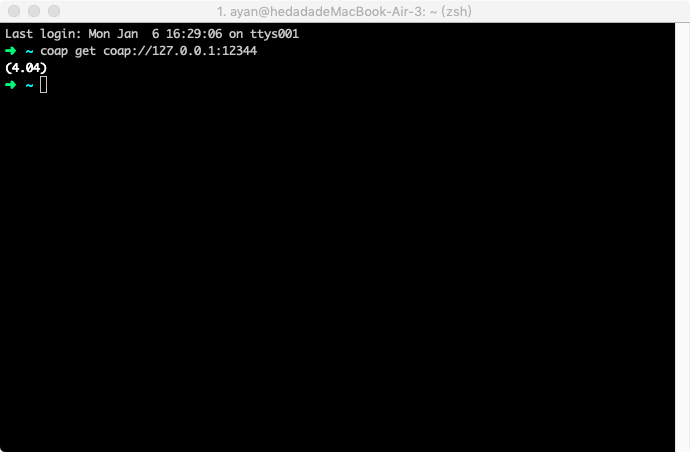
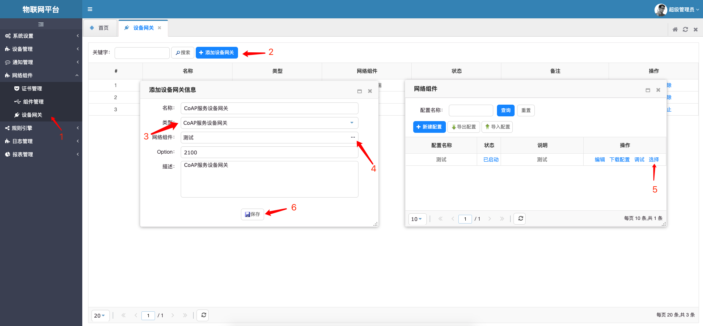
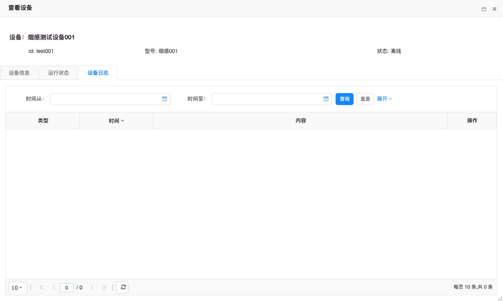

# 启动CoAP服务设备网关,接收设备消息

创建CoAP服务设备网关,处理设备消息。

## 一、 创建CoAP服务并启动

进入系统: `网络组件`-`组件管理` 点击左侧菜单中的`CoAP服务` 添加一个CoAP服务。

点击状态列中的`已停止`开启服务. 状态变为`已启动`则为启动完成.

### 测试连接

使用[Node CoAP CLI](https://www.npmjs.com/package/coap-cli)进行连接测试.

1.[安装](https://www.npmjs.com/package/coap-cli)完成coap cli

2.打开终端，输入 `coap get coap://127.0.0.1:12344` 返回结果为404则表示coap服务启动成功

## 二、创建设备网关

新建设备网关配置

### 设备网关消息处理测试

#### 前提条件

i. 已在平台中创建产品和设备

ii. 设备已接入平台（设备已上线）

> 创建产品和设备具体操作细节，请参考[添加设备型号](../device-manager.md/#添加设备型号)、[添加设备实例](../device-manager.md/#添加设备实例)。
>
> 设备接入平台，请参考[设备接入教程](device-connection.md)

#### 创建成功的设备实例信息展示
     
i. 设备基本信息

ii. 设备运行状态信息

iii. 设备日志

#### 使用Node CoAP CLI测试

i. 安装[Node CoAP CLI](https://www.npmjs.com/package/coap-cli)

ii. 点击`操作`列中的`启动`按钮，启动网关。

iii. 终端输入: `coap post coap://127.0.0.1:12344/chiefdata/push/fire_alarm/department/1/area/1/dev/test001 -p {\"devid\":\"test001\"} -O 2100,test001` 

vi. 设备收到一条上报事件则代表CoAP网关测试成功

网关状态说明:

1. 停止:网关完全停止.不再接受设备连接,以及消息.重新启动后只会接受最新的连接以及消息。
2. 暂停:网关不再接受新的设备连接,以及消息.重新启动后恢复处理之前的所有连接的消息。
3. 启动:网关处理新的设备连接以及消息。

## 设备连接

参照[使用自定义消息协议接入设备](device-connection.md)进行设备配置,注册,以及连接,消息收发测试。