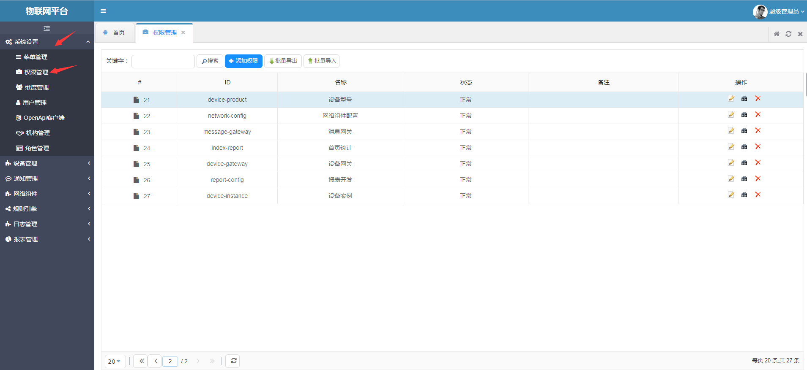
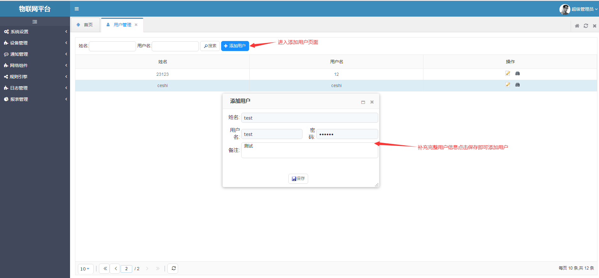
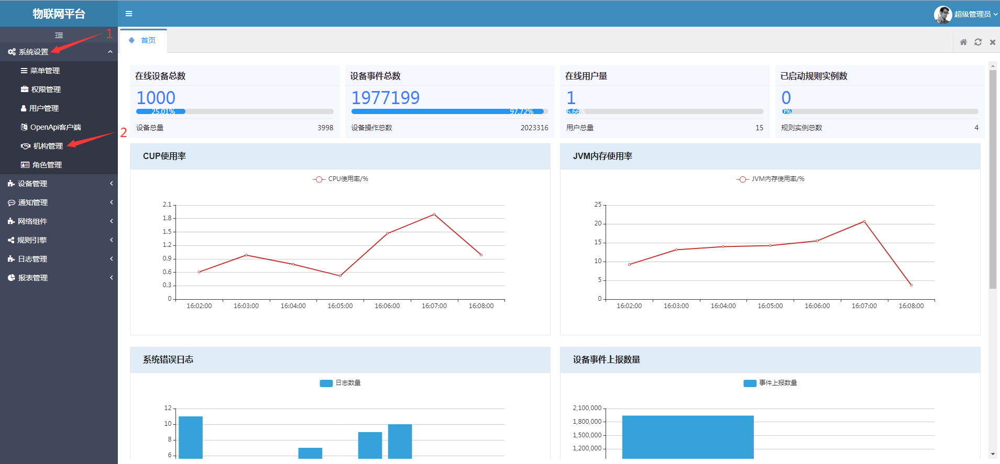

# 使用组织架构进行设备数据权限控制教程  
使用超级管理员用户登录系统（默认账号密码：admin admin）。  
>注意：该账号只能用于系统设置相关功能，请勿使用该账号操作业务功能。  

**操作步骤**
1. 在系统左侧导航栏，单击系统设置>权限管理。  
  
2. 在权限管理页，选择设备型号权限。点击`编辑`按钮进入编辑页。  
  
 i.在`支持的数据权限控制方式`下拉列表处选择`机构`；  
    
 ii.在i的基础上`操作配置`中`支持数据权限`下拉列表将会出现`机构`的选择，选择即可；  
   
 iii.在`操作配置`-->`支持数据权限`列下拉列表中选择`机构`选项。    
 如查询操作选择了机构数据权限，则在型号管理功能界面查询时将进行机构数据权限控制，用户将只能查询到自己所在机构的数据。  
 iv.在该页底部点击`保存`按钮即可保存配置。  
3. 在系统左侧导航栏，单击系统设置>用户管理。  
  
4. 用户管理页面选择需要分配权限的用户，点击`用户赋权`按钮进入用户赋权页面。  
  
如果需要新建用户，请点击`添加用户`按钮，补充完用户数据，点击`保存`即可完成新用户增加。  
  
5. 进入用户赋权页面，定位到设备型号，该行将多出一个`数据权限`按钮，点击进入数据权限控制配置。  
  
6. 在数据权限配置页面，选择`仅限所在机构数据`行提供的选项。  
  
7. 点击赋权页下方`保存`按钮完成用户赋权操作。  
  
8. 在系统左侧导航栏，单击系统设置>机构管理。  
  
9. 在机构管理页面，选择需要赋予用户的机构，点击该机构行选中，点击右侧上方`绑定用户`按钮进入选择用户页面。   
  
在选择用户界面，查询到需要绑定的用户，在操作列点击`选中`按钮即可绑定。  
  
机构数据权限分配演示：  

