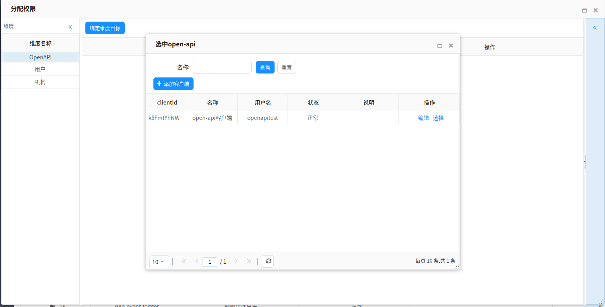
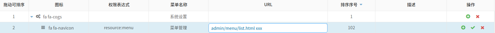
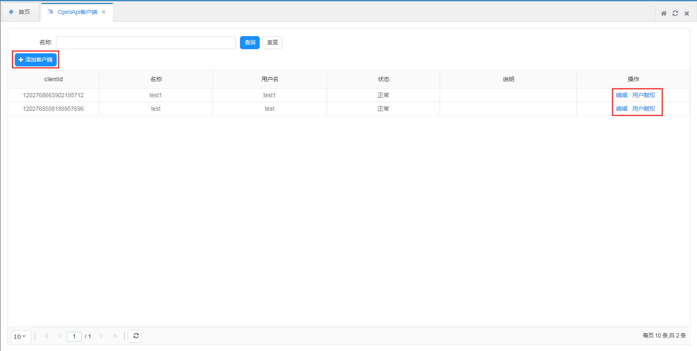

# 系统设置

系统设置用于配置系统权限,用户等系统运行所需等基础配置.

## 权限设置
权限指在某种条件下，允许或拒绝对某些资源执行某些操作。
设置权限便于控制用户或角色等对系统资源的访问。

###一、新增

**操作步骤**
1. 使用超级管理员用户登录系统（默认账号密码：admin admin）。
2. 在左侧导航栏，单击系统设置>权限管理。
3. 在权限管理页，单击添加权限。
4. 在新建权限页，添加权限内容。此页分为基本信息、关联权限、数据视图三个选项卡。
5. 配置完成后在该页底布点击保存按钮即可保存。

基本信息参数如下：

参数       | 描述
-------------- | -------------
权限标识|唯一标识权限的id,需与相应接口@Resource注解的id属性一致，字符串类型，不能为空，如：device-properties
权限名称|权限的名称，字符串类型，不能为空，如“证书管理”。
支持的数据权限控制方式|数据权限控制的类型，可从"字段权限"和维度类型的各类型中选择，支持多选。
分类|
操作配置|对增、删、改、查等操作进行配置，此处为表格展示，将单独介绍此配置。

操作配置详情：

参数       | 描述
-------------- | -------------
标识|操作的唯一标识，如query、save、delete等。
描述|对操作进行描述，如查询、保存、删除等。
支持的数据权限|列出上文中 `支持的数据权限控制方式` 所勾选的选项进行选择，支持多选。
操作|表头行提供新增一行的按钮，列表行提供删除该行的按钮。

关联权限参数如下：

参数       | 描述
-------------- | -------------
前置操作|该列为下拉列表，展示当前编辑权限基本信息中的操作配置，支持多选。
关联权限|该列为权限管理列表中除当前权限以外的数据构成的下拉列表，只能单选。
关联操作|由关联权限的操作配置构成的下拉列表，支持多选。
操作|表头行提供新增一行的按钮，列表行提供删除该行的按钮。

数据视图参数如下：

参数       | 描述
-------------- | -------------
字段|该权限对应实体类的所有字段，字符串类型，如设备型号中metadata、name等。
描述|用于描述对于字段。
操作|表头行提供新增一行的按钮，列表行提供删除该行的按钮。

###二、编辑

编辑操作与新增相同，参考第一点。

###三、查询

进入权限管理页，将会自动分页查询出所有权限，默认每页20条数据。

该页顶部可根据ID、名称、备注进行条件查询。

###四、设置权限
在权限管理页的操作列点击设置权限按钮进入分配权限页。

**操作步骤**

1. 点击左侧维度类型，将加载出`绑定维度目标`按钮。
2. 点击`绑定维度目标`按钮进入选中维度目标页，该页列表将加载出已绑定维度的所有维度目标，若列表为空，则点击添加按钮新增。
3. 在操作行点击`选中`按钮即可绑定，同时可点击`编辑`按钮修改该行数据。

4. 绑定完成后点击绑定行即会加载出权限设置页。

5. 该页提供勾选权限管理页的操作配置选项（如：查询、保存、删除等）。
6. 字段权限。
7. 数据权限。
8. 该页底部点击`保存`按钮即可完成权限设置。

###批量导出
在权限管理页点击`批量导出`按钮，可导出当前系统配置的所有权限并生成json文件，支持根据查询条件导出。

###批量导入
在权限管理页点击`批量导入`按钮，可导入由批量导出生成的json文件。

## 菜单设置
菜单设置用于配置系统导航栏菜单。

###一、新增

**操作步骤**
1. 使用超级管理员用户登录系统（默认账号密码：admin admin）。
2. 在左侧导航栏，单击系统设置>菜单管理。
3. 在菜单管理页，单击`添加菜单`按钮，将自动在列表行添加一行未编辑数据，编辑完成后点击操作列保存按钮即完成新增。

菜单列表参数如下：

参数       | 描述
-------------- | -------------
拖动可排序|前端排序序号，点击可拖动调整顺序。
图标|可选择图标用于在导航菜单栏展示，系统提供了大量图标供用户选择。
权限表达式|菜单显示的条件，当用户拥有表达式中的权限时才展示该菜单，字符串，格式为：`resource` + `:` +`权限标识`，例如：resource:dictionary。
菜单名称|单个菜单的名称，字符串，如：数据字典。设置后将展示在导航菜单。
URL|菜单对应页面的路径，字符串，如：admin/dictionary/list.html。
排序序号|用于菜单在导航栏展示时的排序。
描述|简要介绍菜单。
操作|提供删除该行的按钮以及添加子菜单的按钮。

###二、查询
菜单管理列表页支持关键字查询，可根据权限表达式、菜单名称、url进行模糊查询。

###三、修改
菜单管理列表页点击除操作列的单元格可直接进行编辑，然后点击操作列中的`保存`按钮即可保存。

###四、删除
菜单管理列表页点击操作列`删除`按钮即可删除点击行。

###五、批量导出
在菜单管理页点击`批量导出`按钮，可导出当前系统配置的所有权限并生成json文件，支持根据查询条件导出。

###批量导入
在菜单管理页点击`批量导入`按钮，可导入由批量导出生成的json文件。

## 用户管理
用户管理用户系统用户维护，分配权限等。

###一、新增
**操作步骤**

1. 使用超级管理员用户登录系统（默认账号密码：admin admin）。
2. 在左侧导航栏，单击系统设置>用户管理。
3. 在用户管理页点击`添加用户`按钮弹出添加用户页面。

编辑用户参数如下：

参数       | 描述
-------------- | -------------
姓名|用户的姓名，字符串，不能为空，如：张三。
用户名|系统登录时所需的账号，字符串，不能为空，如：admin。
密码|系统登录时所需的密码，字符串，不能为空，如：123456。
备注|对菜单特点进行简要描述。

4.编辑完成后点击`保存`按钮，新增用户成功。

###二、查询
用户管理列表页支持条件查询，可根据权姓名、用户名进行模糊查询。

###三、修改
用户管理列表页点击操作列的单元格可直接进行编辑，然后点击操作列中的`保存`按钮即可保存。

## 权限分配
权限分配便于系统控制不同用户对系统资源的访问范围。
### 字段权限
todo
### 数据权限
todo

### OpenApi客户端

**添加OpenApi客户端操作步骤**

1. 登录物联网管理平台。
2. 在左侧导航栏，选择系统设置 > OpenApi客户端。
3. 在OpenApi客户端管理页面OpenApi客户端列表中，单击OpenApi客户端所对应的`新建客户端`操作按钮。
4. 在弹出对话框中，填写客户端所对应的信息。

参数 | 描述
-------------- | -------------
名称      |为客户端命名。例如：JetLinks客户端。支持中文、英文字母、数字、下划线（_）、连接号（-）、@符号和英文圆括号，长度限制4~30，一个中文汉字算2位。
clientId      |客户端ID，用于标识用户。
secureKey      |是用来验证用户的密钥。secureKey必须保密。
用户名      |系统用户，用于登录物联网平台的用户名。
密码      |系统用户密码。
签名方式      |对请求数据进行加密的方式分为两种：MD5和SHA256。用于确保信息传输完整一致。
ip白名单      | 设置应用IP白名单，特定接口的调用需要配置IP白名单。在调用openApi某些接口时为了信息安全，需要在指定IP的服务器上调用。
说明      | 输入文字，对该属性进行说明或备注。长度限制为100字。

#### 授权步骤

1. 在OpenApi客户端管理页面OpenApi客户端列表中，单击OpenApi客户端列表中所对应的`用户赋权`操作按钮。
2. 在弹出的对话框内勾选对应的权限，勾选完成后点击`保存`即可。

因为管理员账号具有账号的完全权限，管理员账号泄露会带来极严重的安全隐患。因此，若需要授权其他人访问查看openApi接口信息，就需要对该用户授予需要的访问权限。请勿直接将管理员账号及密码直接泄露出去。

[下一步,网络组件](network.md)